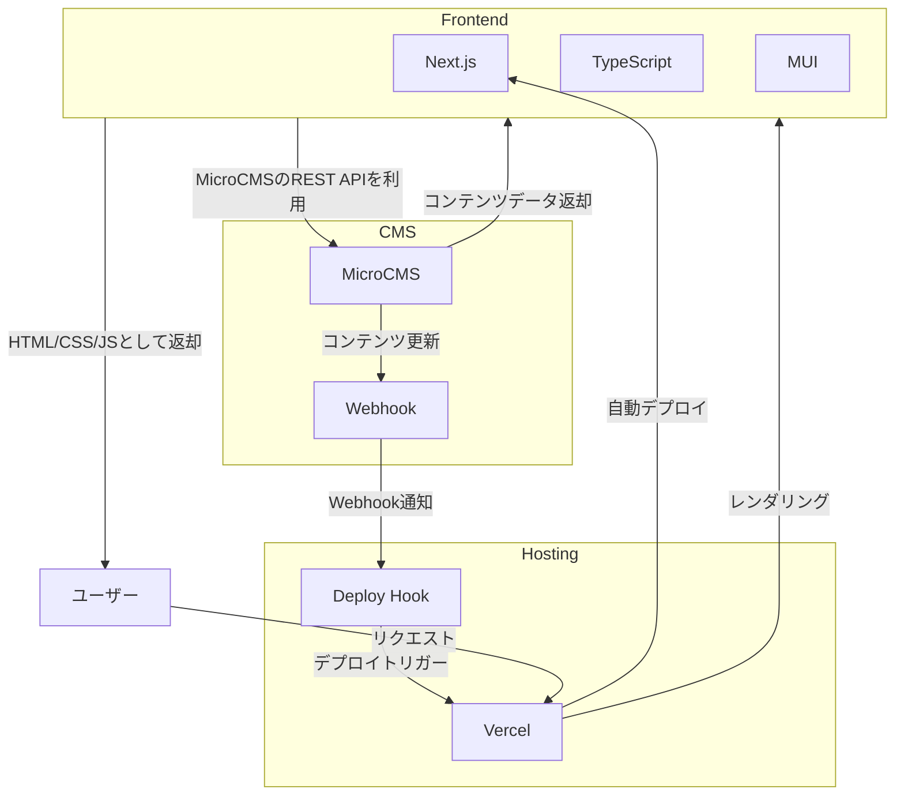

## 概要

技術的なアウトプットを目的としたテックブログ兼ポートフォリオです

https://yasdtech.com/

## アーキテクチャ図

```mermaid
graph TD
  %% フロントエンド
  subgraph Frontend
    A[Next.js]
    B[TypeScript]
    C[MUI]
  end

  %% CMS
  subgraph CMS
    D[MicroCMS]
    E[Webhook]
  end

  %% ホスティング
  subgraph Hosting
    F[Vercel]
    G[Deploy Hook]
  end

  %% データフローの説明
  D -->|コンテンツ更新| E
  E -->|Webhook通知| G
  G -->|デプロイトリガー| F
  F -->|自動デプロイ| A

  Users[ユーザー] -->|リクエスト| F
  F -->|レンダリング| Frontend
  Frontend -->|MicroCMSのREST APIを利用| D
  D -->|コンテンツデータ返却| Frontend
  Frontend -->|HTML/CSS/JSとして返却| Users
```
